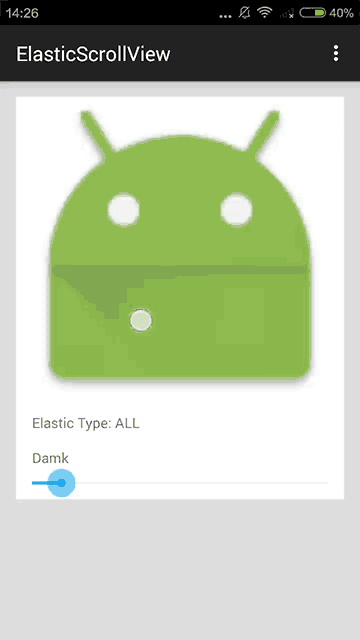

# ElasticScrollView
A scrollView,has elastic



### Version 1.0
完成回弹功能

### Version 1.1
新添加两个的方法

* setDamk()
设置滑动的阻力

* setElasticVIew()
设置被拉伸的View.如果不设置或设置为null,则ScrollVie跟随手势移动

### Version 1.2

* 使用NindOldAndroid动画效果
* 修复Bug: elasticView向上滑动至height == -1时,被认为是wrap_content的问题
* 添加elasticId属性

Sample Code:
``` xml
<org.kitdroid.widget.ElasticScrollView
    app:elasticId="@+id/iv"
    android:layout_width="match_parent"
    android:layout_height="match_parent"/>
```
